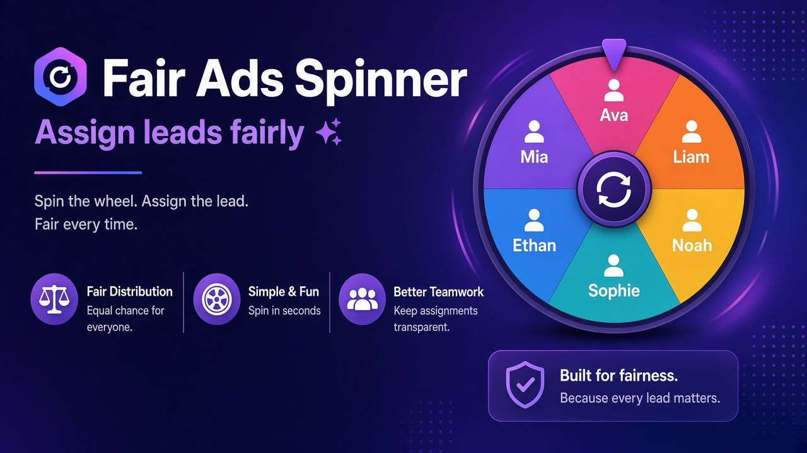
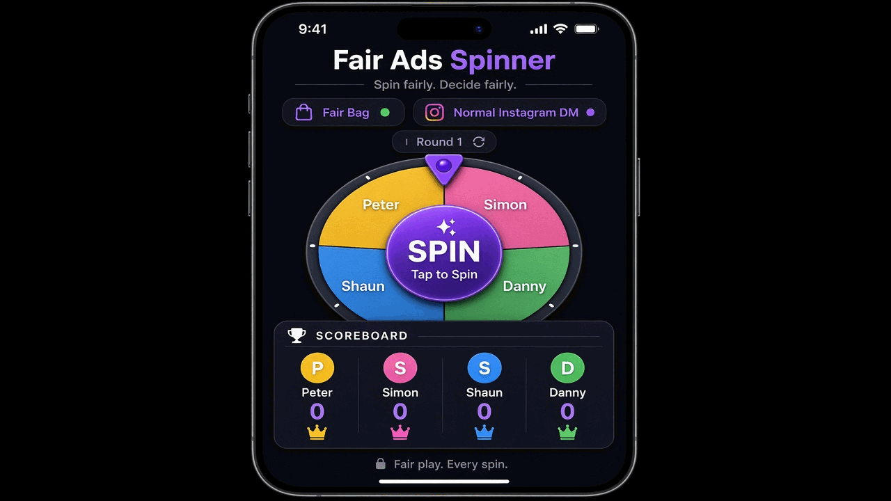
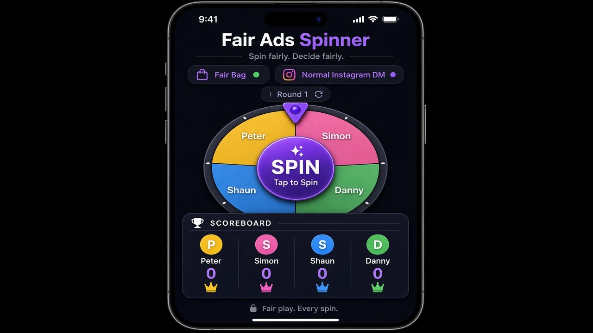
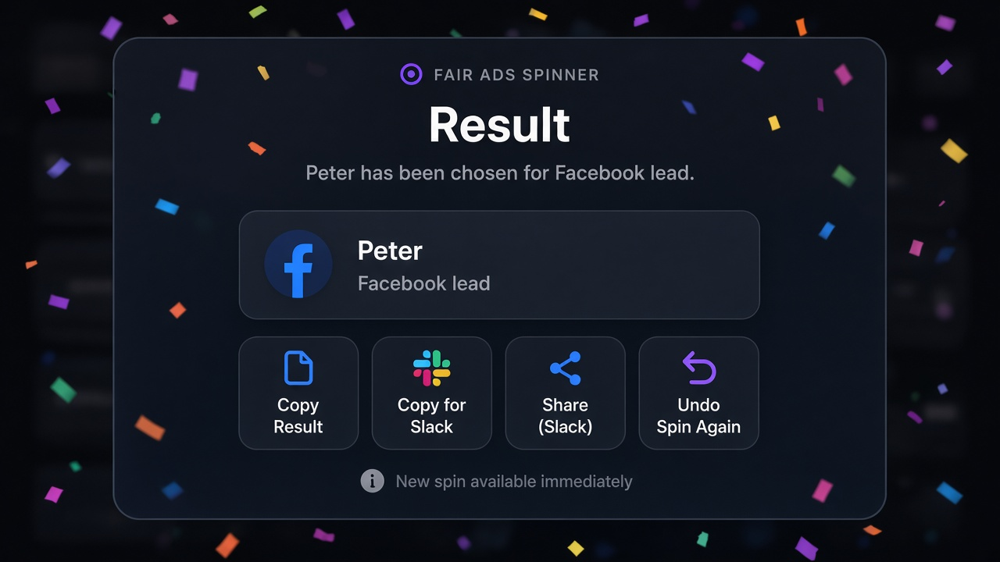
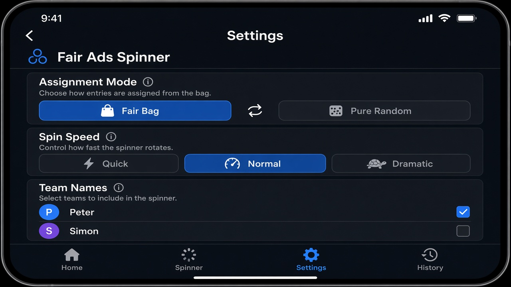
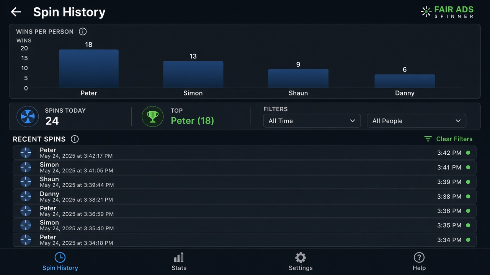

<p align="center">
  
</p>

<h1 align="center">Fair Ads Spinner</h1>

<p align="center">
  <strong>Spin the wheel. Pick someone fairly. Paste in chat.</strong><br>
  Assign ads &amp; leads to your team — no backend, works offline.
</p>

<p align="center">
  <a href="https://jsonyung.github.io/RandomSpin/"></a>
  <a href="https://github.com/jsonyung/RandomSpin"></a>
  
  
  
</p>

<p align="center">
  <a href="https://jsonyung.github.io/RandomSpin/">🎯 Open App</a>
  &nbsp;·&nbsp;
  <a href="#quick-start">Quick Start</a>
  &nbsp;·&nbsp;
  <a href="#features">Features</a>
  &nbsp;·&nbsp;
  <a href="#screenshots">Screenshots</a>
  &nbsp;·&nbsp;
  <a href="#project-structure">Structure</a>
</p>

---

<p align="center">
  
</p>

## What is it?

**Fair Ads Spinner** is a free web app for sales &amp; support teams. When a **Facebook lead**, **Instagram DM**, **callback**, or **walk-in** comes in — spin once, get a name, copy the result to Slack or WhatsApp.

Built for teams like **Peter · Simon · Shaun · Danny** who need **equal ads** without arguments.

| | |
|---|---|
| 🎯 **One tap** | SPIN or press **Space** |
| ⚖️ **Fair modes** | Fair Bag (recommended), luck, weighted, + extras |
| 📋 **Task presets** | Facebook lead, Callback, Instagram DM… |
| 📊 **History & CSV** | Last 500 spins, charts, export |
| 📱 **Install** | Add to Home Screen — works offline |
| 🔒 **PIN lock** | Stop accidental mode changes |

---

## Demo

<p align="center">
  
</p>

<p align="center"><em>Spin → result → settings → history (auto slideshow)</em></p>

**Try live:** **[jsonyung.github.io/RandomSpin](https://jsonyung.github.io/RandomSpin/)**

---

## Quick start

```
1. Open the app  →  complete the 30-second tour (or tap ?)
2. Settings ⚙    →  add your team, set task, pick Fair Bag
3. Lead comes in →  SPIN (or Space)
4. Copy Result   →  paste in team chat
```

### Share with your team

Settings → **Copy Team Link** — sends a URL with names, mode, speed & task baked in:

```
https://jsonyung.github.io/RandomSpin/?names=Peter,Simon,Shaun,Danny&mode=fairBag&speed=normal&task=Facebook+lead
```

### Install on phone (PWA)

| Platform | How |
|----------|-----|
| **iPhone** | Safari → Share → **Add to Home Screen** |
| **Android** | Chrome → menu → **Install app** |
| **Desktop** | Chrome address bar → install icon |

---

## Screenshots

<table>
  <tr>
    <td align="center"><strong>Home — spin wheel</strong><br></td>
    <td align="center"><strong>Result — copy to chat</strong><br></td>
  </tr>
  <tr>
    <td align="center"><strong>Settings — modes &amp; team</strong><br></td>
    <td align="center"><strong>History — charts &amp; CSV</strong><br></td>
  </tr>
</table>

> Screenshots are illustrative mockups of the app UI. [Open the live app](https://jsonyung.github.io/RandomSpin/) for the real thing.

---

## Features

### Fairness modes

| Mode | Best for |
|------|----------|
| **⭐ Fair Bag** | Equal ads — everyone gets 1 per round, shuffled order |
| **🎲 Pure Random** | True luck — coin flip every spin |
| **⚖️ Weighted** | Soft catch-up for whoever is behind |
| **📋 Extra rules** | Anti-Repeat, Last Excluded, Lowest First, Strict Balance |

Tap **❓ Which mode?** on home or use **Help me choose** in Settings.

### Daily workflow

- **Recent task chips** on home — tap to reuse last tasks
- **Fair Bag preview** — see who's left this round + who's next
- **Today's summary** — one tap copy for Slack/manager
- **Undo last spin** — mis-click? revert instantly
- **Share result** — native share or WhatsApp

### Records & admin

- Spin **history** with bar chart + filters (date, person, task, mode)
- Export **filtered CSV**, weekly report, full JSON backup
- **Daily reset** at shift start (counts zero, history kept)
- **PIN lock** for mode/speed + optional lock on reset counts

---

## Keyboard shortcuts

| Key | Action |
|-----|--------|
| **Space** | Spin |
| **Space** (again) | Close result & spin again |
| **Escape** | Close modals / back from settings |

---

## Project structure

```
RandomSpin/
├── index.html              # HTML shell
├── css/
│   ├── main.css            # Entry (@import)
│   ├── variables.css       # Theme tokens
│   └── layout.css          # Components & pages
├── js/
│   ├── main.js             # Entry point
│   ├── config.js           # Constants
│   ├── state.js            # App state
│   ├── dom.js              # DOM bindings
│   ├── app-logic.js        # Wheel, modes, storage, UI
│   ├── events.js           # Event listeners
│   └── init.js             # Bootstrap
├── docs/images/            # README screenshots & demo.gif
├── manifest.webmanifest    # PWA manifest
├── sw.js                   # Offline service worker
└── icon-192.png, icon-512.png
```

**No build step** — ES modules run directly on GitHub Pages.

---

## Local development

```bash
git clone https://github.com/jsonyung/RandomSpin.git
cd RandomSpin
python3 -m http.server 8765
# → http://localhost:8765
```

---

## Tech stack

- **HTML / CSS / JavaScript** (ES modules)
- **localStorage** — all data stays on device
- **Service Worker** — offline cache
- **Web Audio API** — spin sounds
- **No npm, no backend, no account**

---

## Roadmap (fun project → maybe game later)

- [ ] XP & badges per lead handled
- [ ] Custom wheel themes / team branding
- [ ] Optional cloud sync (when ready)
- [ ] Split `app-logic.js` into smaller modules

---

## Contributing

Fork → branch → PR welcome. Keep it simple — this is a zero-dependency side project.

---

## License

**MIT** — use freely for your team. No warranty.

---

<p align="center">
  <a href="https://jsonyung.github.io/RandomSpin/"></a><br>
  <strong><a href="https://jsonyung.github.io/RandomSpin/">Open Fair Ads Spinner →</a></strong>
</p>
